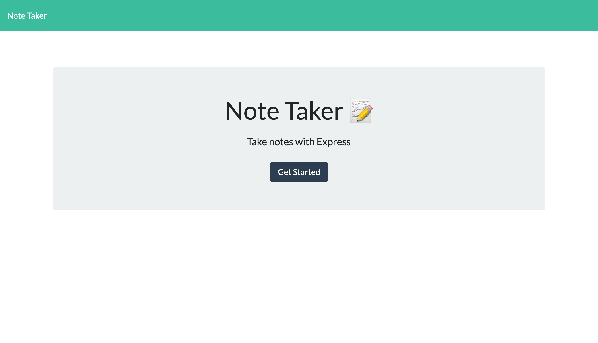
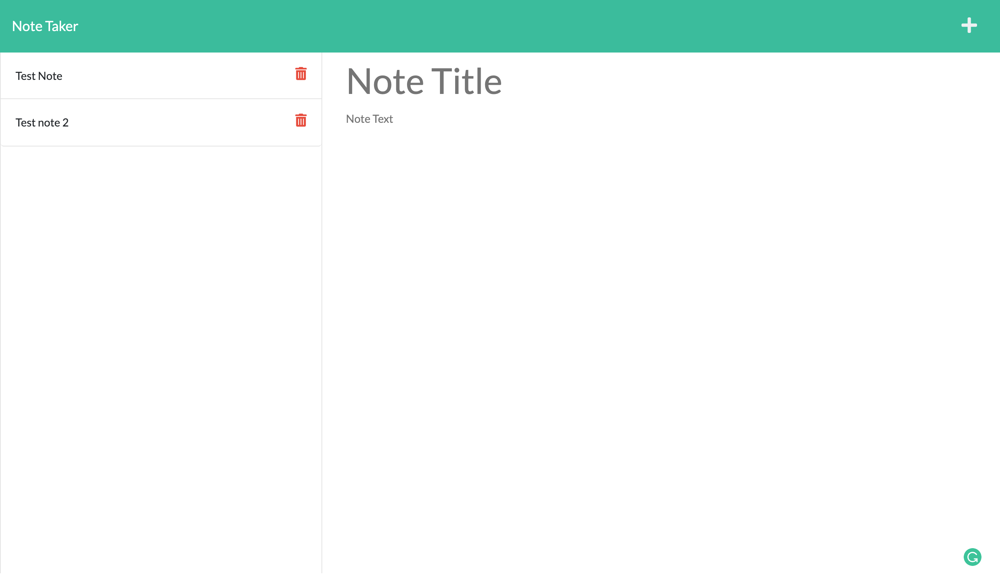

# Note Taker App

## Description

This is a note taking app that uses a node express backend. It allows the user to create, save, and delete their notes.

From the home page, click "Get Started" to view the Notes page. On the Notes page, use the right panel to write and title your notes. Select the "Save" icon at the top after finishing entering your note. Your saved note will show up in the left panel. From this panel you can delete any notes you no longer need.

## Deployment

Deployed on Railway: [Link](https://note-taker-production-657c.up.railway.app/)

(Since Heroku will no longer be providing free hosting, the class is using Railway for hosting)

## Screenshots




## Getting Started

### Installation

```sh
npm i
```

Start the app

```shell
npm start
```

Run nodemon

```shell
npm run dev
```
